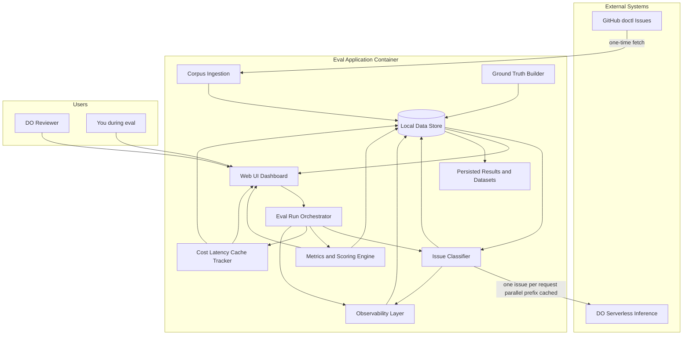
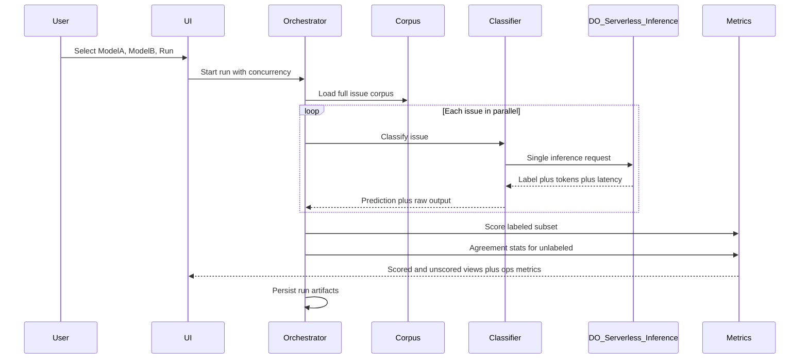
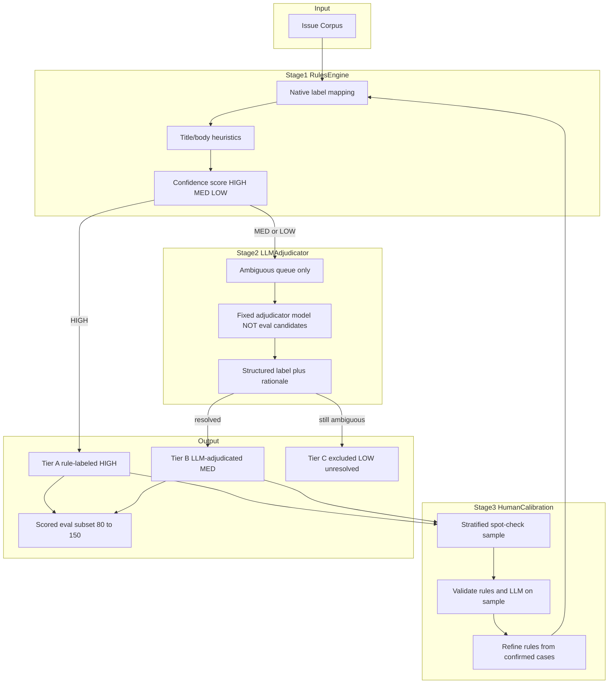
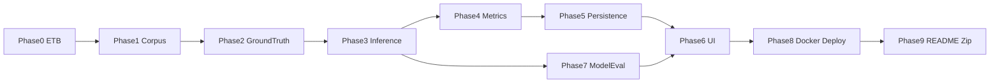

# FDE Evaluation Exercise — Phased Implementation Plan

## Current state

- Requirements documented in [`docs/`](docs/) (problem, I/O, labels, ambiguities, scale/fine-tuning).
- Credentials verified: `GITHUB_TOKEN` (bhav66d) and `DO_API` (Serverless Inference + 74 models) in [`.env`](.env).
- **Phases 0–9 implemented** — full eval harness with UI, model recommendations, Docker, DO deploy spec.
- **534 issues** in `data/corpus/doctl/v1/issues.jsonl`; ground truth in `data/ground_truth/labels.json` (150 scored set).
- **Web UI:** React + Radix/Tailwind (21st.dev-style stat cards, tabs, progress) at `/` via FastAPI.
- **Tests:** 46 passing (`pytest tests/ -v`).

### Phase 3 additions (context overflow)

Shared truncator in `src/inference/context.py` wired into classifier and ground-truth adjudicator:

| Config | Default | Purpose |
|---|---|---|
| `BODY_TRUNCATE_CHARS` | 8000 | Hard char cap on issue body |
| `MODEL_CONTEXT_TOKENS` | 32768 | Model context budget |
| `COMPLETION_BUDGET` | 256 | Reserved tokens for completion |

On context-length API errors: retry with body halved (up to `MAX_RETRIES`). Truncation metadata persisted in `predictions.jsonl`.

### Phase 3–5 module map

| Module | Key files |
|---|---|
| Inference | `src/inference/{context,classifier,runner,cost,models}.py` |
| Metrics | `src/metrics/{accumulator,scoring}.py` |
| Eval | `src/eval/{orchestrator,persistence,run}.py` |
| Artifacts | `results/runs/<run_id>/{manifest,checkpoint,predictions,metrics,errors}.json(l)` |
| Registry | `results/eval.db` (SQLite) |

**CLI:** `python -m eval.run --mock --limit 20` or `make run-eval`

**Not yet implemented:** Phases 6–9 (UI, staged model eval, Docker, submission bundle).

**Recommended operating mode:** `[MVP]` — ship the exercise on ~534 doctl issues; `[Architect for 10–100×]` — design choices must not break at ~5k–50k issues, but do **not** build, load-test, or optimize for 1000×.

---

## Scale philosophy (build vs architect)

| | **T0 — Build & demo** | **T1 — Architect for** | **Out of scope** |
|---|---|---|---|
| **Scale** | ~534 issues, 1 repo | **10–100×** (~5k–50k issues, many repos) | 1000× load tests, Kafka/k8s fleets, 534k runs |
| **What we ship** | Full working eval on doctl | Interfaces + patterns that survive growth | Production multi-tenant platform |
| **What we document** | Numbers from T0 runs | README narrative: "same design handles 10–100× because…" | Deep 1000× infra design |

**Rule:** Implement only what T0 needs; add **structural hooks** (partition keys, JSONL append, checkpoint, pagination) so T1 does not require a rewrite. Avoid building T1-only infrastructure (worker fleets, merge tools, reservoir sampling) unless a hook is trivial (e.g. `repo_id` field on every row).

---

## Scale targets (reference architecture)

Design every phase so it works on doctl today and **would** degrade gracefully at 10–100× without redesign:

| Tier | Corpus size | Repos | Inference calls per model (full run) | Ground truth LLM calls | **Implementation** |
|---|---:|---:|---:|---:|---|
| **T0 — Build now** | ~534 | 1 (doctl) | ~534 | ~120–180 | **Ship this** |
| **T1 — Design for** | ~5,300–53,400 | ~10–100 | same ratio | ~500–8,000 (10–15%) | **Hooks only; README narrative** |

**Scale levers (architectural — implement minimal version at T0, full benefit at T1):**
- **Partitioning** — include `repo_id` / `issue_id`; layout supports `corpus/{repo}/issues.jsonl` (T0 uses one partition)
- **Checkpoint/resume** — implement for T0 runs; essential at T1 (~53k calls)
- **Adaptive concurrency** — implement; prevents rate-limit death at T1
- **Prefix prompt caching** — implement and measure on T0; primary T1 cost lever
- **Incremental I/O** — append-only JSONL + streaming metrics (lightweight at T0, required at T1)
- **UI pagination** — implement early; T0 works without it but pattern is ready for T1
- **Idempotency** — `issue_id + model + prompt_version` dedupe key

---

## Cross-cutting: Prompt prefix caching (DO Serverless Inference)

**PDF constraint preserved:** one issue per inference request — caching does **not** mean batching issues. It means the **shared static prefix** (system prompt + label schema + output format) is cached by DO **per model** across repeated requests to that model.

### Why user model selection does NOT break caching

Prefix cache is **not one global cache for all models**. On DO Serverless Inference:
- Each **model endpoint** maintains its **own** cache namespace (isolated per customer account)
- The **same static system prompt** is sent to Model A and Model B, but each model caches its prefix **independently**
- A comparison run (Model A + Model B on 534 issues) = two separate cache streams, each benefiting from ~533 cache hits after the first request

```
User selects Model A + Model B → Run comparison

Model A: 534 requests, identical system prompt → cache warms on req 1, hits on 2–534
Model B: 534 requests, identical system prompt → separate cache, same pattern
```

**When user changes models:** the new model starts with a cold cache (request 1 miss, then hits). This is expected — still valuable for full-corpus runs on a fixed pair. UI model selectors do **not** require removing caching.

**What we do NOT claim:** one cached prefix shared across different model slugs. **What we do track:** `cache_hit_rate` and `cache_savings_usd` **per model per run** in ops metrics.

**DO capability (July 2026 docs):** Prompt caching for **open-source models** on Serverless Inference is in **public preview**. Caching is **automatic** for supported models — no `cache_control` parameter required. Supported models include DeepSeek V3.2/V4, Kimi K2.5/K2.6, GLM-5/5.1/5.2, gpt-oss-120b, MiMo V2.5, MiniMax M2.5, Qwen 3.5, Qwen3 Coder Flash. Tag each model with `cache_supported` in catalog — non-supported models still work; cache metrics show `cache_supported: false`.

**Prompt structure (mandatory for cache hits):**

```
[STATIC PREFIX — identical every request]
  - System instructions
  - Six label definitions
  - JSON output schema
  - Classification rubric / examples (if any)

[DYNAMIC SUFFIX — per issue]
  - Issue title
  - Issue body (truncated)
```

**Rules for max cache efficiency:**
- Never put timestamps, run_id, or issue_id in the prefix
- Never vary whitespace in the static block between requests
- Use the same `prompt_version` hash for an entire run
- Prefer models that support open-source caching when cost matters

**Telemetry (from API `usage` object):**
- Track `prompt_tokens`, `cache_read_input_tokens`, `prompt_tokens_details.cached_tokens`
- Compute: `cache_hit_rate = cached_tokens / prompt_tokens`
- Compute: `cost_with_cache` vs `cost_without_cache` (counterfactual at full input rate)
- Surface in Ops tab and README

**Guardrail:** If a model does not report cache fields, log `cache_supported: false` and bill at full input rate — do not assume savings.

**At 10–100× (architectural target):** Prefix caching is the primary cost lever (static prefix × thousands of requests). T0 run proves cache_hit_rate; README extrapolates to ~5k–50k issues with same prompt structure. Expected savings: 40–70% on input token cost for supported models.

---

## Cross-cutting: Monitoring and observability

Observability is a **first-class deliverable** — supports review discussion on production inference and makes long runs debuggable at scale.

### Architecture addition

```mermaid
flowchart TB
  subgraph app [Eval Application]
    Orchestrator[Run Orchestrator]
    Classifier[Classifier]
    Obs[Observability Layer]
  end

  subgraph signals [Signals]
    Logs[Structured JSON logs]
    Metrics[Run metrics store]
    Traces[Request trace records]
    Events[Event timeline]
  end

  subgraph surfaces [Surfaces]
    OpsUI[Ops UI tab]
    Health[/health and /ready]
    Export[metrics.json export]
  end

  Orchestrator --> Obs
  Classifier --> Obs
  Obs --> Logs
  Obs --> Metrics
  Obs --> Traces
  Obs --> Events
  Metrics --> OpsUI
  Metrics --> Export
  Events --> OpsUI
  Health --> Obs
```

### What to instrument (every phase)

| Signal | Fields | Where stored |
|---|---|---|
| **Run span** | `run_id`, `model`, `corpus_version`, `concurrency`, `prompt_version`, start/end | `results/runs/<id>/manifest.json` |
| **Request span** | `issue_id`, `latency_ms`, `tokens_in/out`, `cached_tokens`, `cost_usd`, `status`, `error_type`, `retry_count` | `predictions.jsonl` |
| **Aggregate tick** | every N requests: rolling p50/p95, RPS, error_rate, cache_hit_rate | `metrics_timeseries.jsonl` |
| **Structured log** | JSON lines: level, timestamp, run_id, issue_id, event | stdout + `results/runs/<id>/events.log` |
| **Ground truth pipeline** | rules_hit_rate, llm_queue_depth, human_calibration_agreement | `data/ground_truth/pipeline_metrics.json` |

### Health endpoints (Phase 8)

- `GET /health` — process alive
- `GET /ready` — corpus loaded, SI API reachable, DB writable
- `GET /runs/{id}/status` — progress: `{completed, total, failed, rps, eta}`

### UI observability (Ops tab extensions)

- Live run progress bar with RPS and ETA
- Latency histogram (p50/p95/p99)
- Error breakdown pie: rate_limit / timeout / parse / other
- Cache hit rate + estimated savings
- Concurrency vs latency chart (for tradeoff discussion)
- Event timeline: run started, checkpoint saved, rate limit backoff, run completed

### Production narrative (README / review)

Map harness observability → customer production stack:
- Same metrics → Datadog/Grafana dashboards
- Error taxonomy → alert routing
- Cache hit rate → cost forecasting
- Checkpoint/resume → job orchestration (Temporal/Celery/Kafka consumer)

### Alert thresholds (document, optional lightweight in-app warnings)

| Condition | Warning | Action |
|---|---|---|
| Error rate > 5% | Yellow banner in UI | Reduce concurrency |
| p95 latency > 2× baseline | Log + display | Back off or switch model |
| Cache hit rate < 10% on supported model | Display | Verify prompt structure |
| Run stalled > 60s no progress | Yellow | Check rate limits |

---

## Proposed stack (defensible, explainable)

| Layer | Choice | Why |
|---|---|---|
| Language | Python 3.12 | Fast async for parallel inference; strong ML/eval ecosystem |
| Backend | FastAPI | Async concurrency, OpenAI-compatible client, serves API + static UI |
| Frontend | React (Vite) or lightweight HTMX | Side-by-side views, drill-downs, filters, paginated tables at scale |
| Persistence | SQLite + JSON/JSONL artifacts | Run metadata in SQLite; append-only JSONL for predictions at 100×+ |
| Job progress | In-process async queue (T0); optional Redis queue (T1+ doc) | Checkpoint/resume without re-inference |
| Inference client | `openai` SDK → `https://inference.do-ai.run/v1` | PDF-mandated SI API |
| Observability | structlog + custom metrics collector | JSON logs, run timelines, cache/cost tracking |
| Container | Single Dockerfile, multi-stage build | One runnable artifact for reviewers |
| Deploy | DigitalOcean App Platform | Aligns with exercise; README live URL |

---

## High-level architecture (component view)



**Data flow during a comparison run:**



---

## Phase 0 — Foundation and ETB (gate before coding)

**Goal:** Lock decisions reviewers will question; define scale SLOs, observability contract, and prompt-cache strategy before any code.

**Tasks:**
- Write [`project.md`](project.md) ETB covering:
  - Scope, stack, assumptions A1–A12 from [`docs/ambiguities-assumptions-and-open-questions.md`](docs/ambiguities-assumptions-and-open-questions.md)
  - Ground truth hybrid pipeline summary (rules + selective LLM + human calibration)
  - **Scale tiers T0 (build) / T1 (architect for 10–100×)** — no 1000× build targets
  - **Observability contract** — required signals, log schema, health endpoints
  - **Prompt prefix caching strategy** — static/dynamic split, supported models list
  - Non-goals: no fine-tuning, no full multi-repo prod platform (but document scale path)
- Add [`.gitignore`](.gitignore) (`.env`, `.venv`, `__pycache__`, `*.db`, local overrides).
- Define **config surface** (all runtime-configurable without rebuild):

| Env var | Default | Purpose |
|---|---|---|
| `DO_API` | required | Serverless Inference key |
| `GITHUB_TOKEN` | optional | Corpus fetch only |
| `CONCURRENCY` | 8 | Max parallel inference requests |
| `MAX_RETRIES` | 3 | Per-issue retry cap |
| `REQUEST_TIMEOUT_SEC` | 60 | Per-request timeout |
| `BODY_TRUNCATE_CHARS` | 8000 | Issue body limit |
| `CHECKPOINT_EVERY_N` | 50 | Persist progress every N issues |
| `CORPUS_PATH` | `data/corpus/` | Snapshot location |
| `PROMPT_VERSION` | auto-hash | Tie runs to prompt template |

- Scaffold repo layout:

```
llm-eval-github/
  data/
    corpus/              # versioned snapshots (partitioned at T1+)
    ground_truth/        # labels, queues, calibration, methodology
  results/
    runs/                # per-run artifacts + observability logs
  src/
    ingestion/
    ground_truth/
    inference/
    metrics/
    observability/       # logging, metrics collector, health
    api/
    ui/
  config/
    models_pricing.json  # per-model token rates (refreshable)
    prompt_classification_v1.txt
  Dockerfile
  README.md
  project.md
  docs/
```

**Scale at 10–100× (architectural hooks only):**
- All modules accept `repo_id` / `issue_id` parameters (T0: single repo `doctl`)
- IDs are strings everywhere
- Config driven by env vars — no hardcoded concurrency or paths
- **Do not build:** multi-worker orchestration, shard merge CLI, or load tests at 50k+ for the exercise

**Observability (foundation):**
- Adopt structlog JSON format from day one: `{ts, level, run_id, issue_id, event, ...}`
- Define `RunContext` dataclass propagated through all layers
- Document metric names in `docs/observability.md`

**Exit criteria:** ETB approved; config contract documented; observability schema defined; folder scaffold ready.

---

## Phase 1 — Corpus ingestion (thin, stable, multi-repo ready)

**Goal:** Stable corpus snapshot(s); no live GitHub dependency during eval runs. **Build** for doctl (~534); **architect** for 10–100× multi-repo.

**Tasks (T0 — doctl ~534):**
- Build ingestion script (~150–250 lines per PDF spirit):
  - Fetch open + closed issues from `digitalocean/doctl` via GitHub API using `GITHUB_TOKEN`
  - Persist fields: `issue_id`, `repo`, `issue_number`, `title`, `body`, `state`, `created_at`, `updated_at`, native `labels`, `html_url`, `body_length`
  - Write versioned snapshot: `data/corpus/doctl/v1/issues.jsonl` + `manifest.json` (`fetched_at`, `count`, `sha256`, `github_api_version`)
- **Do not** call GitHub during eval runs — load snapshot only
- Document refresh procedure (`make fetch-corpus` creates v2)

**Tasks (T1 — architectural hooks, implement layout now, use single repo at T0):**
- **Multi-repo manifest:** `data/corpus/manifest.json` listing repos, versions, issue counts (T0: one entry)
- **Partitioned storage:** `data/corpus/{repo}/v{N}/issues.jsonl` — T0 populates only `doctl/`
- **Incremental sync interface:** store `etag` / `since` cursor per repo (implement; run manually on refresh)
- **Content addressing:** SHA256 per issue body; detect drift
- **Deduplication:** global `issue_id = f"{repo}#{number}"` key
- **Validation pass:** manifest counts match file line counts

**Scale math (design reference — do not load-test beyond T0):**

| Tier | Issues | Load strategy at T0/T1 |
|---|---:|---|
| T0 | 534 | Single JSONL in memory — **ship this** |
| T1 (~10–100×) | 5k–50k | Lazy load per repo; stream JSONL — **architecture supports; README only** |

**Observability:**
- Log: `corpus.fetch.start`, `corpus.fetch.page`, `corpus.fetch.complete`, `corpus.validation.pass/fail`
- Metrics: `corpus_issue_count`, `corpus_fetch_duration_sec`, `corpus_bytes`

**Exit criteria:** T0 snapshot loads deterministically; multi-repo partition layout exists; validation pass runs; re-runs use identical input.

---

## Phase 2 — Ground truth dataset (hybrid rules + selective LLM)

**Goal:** A reference label set that is **accurate enough to score models** and **architected to scale** when issue volume grows 100×. Uses LLM only where rules are insufficient — not on every issue.

### Design principle

| Layer | Role at ~534 issues (T0) | Role at ~5k–50k issues (T1 design) |
|---|---|---|
| **Rules engine** | Labels ~60–70% with high confidence | Labels ~70–80% (rules improve over time) |
| **LLM adjudicator** | Labels ~20–30% ambiguous queue only | Labels ~10–15% uncertain queue only |
| **Human calibration** | Spot-check ~30–50 issues for trust | ~0.5–1% review queue + rule refinement |

**Why not LLM on all 500 (or 50k)?** Cost, latency, non-determinism, and circular-trust risk. Rules are free and deterministic at scale; LLM is reserved for cases rules cannot resolve confidently.

**Why not rules alone?** Maintainer labels are inconsistent; ~316 issues lack clean native labels. Rules alone would either exclude too much or mislabel ambiguous cases — hurting scored-set accuracy.

### Labeling pipeline architecture



### Stage 1 — Rules engine (scalable backbone)

Implement deterministic rules ([`docs/labels-analysis.md`](docs/labels-analysis.md)):

- **Native label mapping (priority order):** `security*` → `security`; `bug`; `enhancement`; `question`; `docs` → `documentation`; `duplicate`/spam → `other`
- **Conflict resolution:** If multiple category labels exist, apply fixed priority (`security` > `bug` > …) or route to ambiguous queue
- **Heuristics (title/body only):** e.g. CVE/ghsa patterns → `security`; "how do I"/"?" patterns → `question`; "docs"/"README" → `documentation`
- **Workflow labels ignored for category:** `blocked`, `wontfix`, `help wanted`, etc. do not determine class alone
- **Output per issue:** `proposed_label`, `confidence` (`HIGH`/`MED`/`LOW`), `source` (`rule_native`, `rule_heuristic`, `unresolved`)

**HIGH confidence → Tier A** (eligible for scored set). **MED/LOW/unresolved → Stage 2**.

### Stage 2 — LLM adjudicator (accuracy layer, selective use)

Use LLM **only** on the ambiguous queue (~150–200 issues at current scale, not all ~534).

**Critical guardrail — avoid circular evaluation:**
- Adjudicator must be a **fixed model separate from Model A / Model B** under comparison (e.g. one strong open-weight model chosen once for labeling only, or a different size class)
- Never score a model against labels produced by that same model
- Record `adjudicator_model` and `prompt_version` in every LLM-labeled row

**Adjudication prompt:**
- Input: title + body + native labels as **metadata hints** (not blind to maintainers, but model must justify from text)
- Output: JSON `{ "label": "...", "confidence": "high|medium", "rationale": "..." }`
- Temperature 0; same six-label schema

**Routing after adjudication:**
- `confidence: high` → **Tier B** (eligible for scored set)
- Still ambiguous / low confidence → **Tier C** (excluded from scored set; still in unscored corpus)

**Expected volume at ~534 issues:** ~120–180 LLM calls — affordable for eval. **At T1 (~5k–50k):** ~500–8,000 calls (10–15%) — architecture supports; not run for exercise.

### Stage 3 — Human calibration (trust anchor)

Automated labels need a sanity check — small, not full hand-labeling.

- Manually review **30–50 stratified issues** (cover all six classes, include rule-labeled and LLM-labeled)
- Measure: rules accuracy vs human, LLM adjudicator accuracy vs human on ambiguous subset
- If LLM adjudicator beats rules on ambiguous cases, document that as justification for Stage 2
- Confirmed human labels feed **rule refinement** (promote patterns to heuristics → fewer LLM calls over time)

This satisfies PDF intent: not hand-labeling every issue, but defensible methodology.

### Scored eval subset composition

Target **80–150 issues** for metrics, stratified where possible:

| Source | Typical share | Trust level |
|---|---|---|
| Tier A (rules, HIGH) | ~50–70% of scored set | Silver — fast, auditable |
| Tier B (LLM-adjudicated) | ~30–50% of scored set | Silver+ — needed for sparse/ambiguous classes |
| Tier C | Excluded from scored | Used only in unscored view |

**Sparse class handling (`documentation`, `question`, `enhancement`):** Prefer LLM adjudication + human spot-check over pure rule mapping due to low native label counts.

### Scale path (534 → ~5k–50k issues)

Same pipeline; economics improve as rules mature. **Document in README; do not run at 50k for the exercise.**

| Tier | Rules coverage | LLM queue | Human review | Scored set |
|---|---:|---:|---:|---|
| T0 (~534) | 60–70% | 20–30% (~120–180 calls) | 30–50 spot-checks | 80–150 stratified |
| T1 (~5k–50k) | 70–80% | 10–15% | 0.5–1% | 500–1000 or stratified sample |

**T1 architectural mechanisms (hooks in code, full use post-exercise):**
- **Rule versioning:** `rules_v{N}.yaml` — log rule version per label
- **Batch LLM adjudication queue:** checkpoint queue progress
- **Active learning:** prioritize human review on disagreements
- **Parallel rule engine:** map over JSONL partitions (embarrassingly parallel, no API cost)
- **Ground truth immutability:** `issue_id → label` fixed per `ground_truth_version`

**Do not build for the exercise:** separate 2,000-issue holdout scoring pipeline, 534k-scale human review queues, or automated rule promotion jobs.

**Production parallel (README scope item 5):** Same three-stage funnel becomes customer runtime — rules → LLM fallback → human queue. Observability tracks funnel conversion rates at each stage.

### Observability (Phase 2)

- Metrics: `ground_truth.rules.high/med/low counts`, `ground_truth.llm_queue.size`, `ground_truth.llm.latency`, `ground_truth.human.agreement_rate`
- Log every labeling decision with `source`, `confidence`, `rule_id` or `adjudicator_model`
- Pipeline report: `data/ground_truth/pipeline_metrics.json` — consumed by Ops UI

### Deliverable files

- `data/ground_truth/labels.json` — per issue: `label`, `tier` (A/B/C), `source` (rule/llm/human), `confidence`, `mapping_reason`, `adjudicator_model` if applicable
- `data/ground_truth/ambiguous_queue.json` — issues sent to LLM adjudicator
- `data/ground_truth/human_calibration.json` — spot-check results
- `data/ground_truth/methodology.md` — pipeline description, volumes per stage, circular-eval guardrails, scale path, known limitations

### Exit criteria

- Scored subset (80–150) defined with per-class counts and source breakdown (rule vs LLM vs human)
- Human calibration sample completed; agreement rates documented
- Adjudicator model documented and distinct from eval comparison models
- Scale narrative written: why this works at 534 and would work at 10–100× without LLM-on-everything
- Limitations honestly stated (maintainer noise, sparse classes, LLM adjudicator bias)

---

## Phase 3 — Classification and inference engine

**Goal:** Per-issue parallel classification via DO Serverless Inference with prefix caching, adaptive concurrency, checkpoint/resume, and full observability. PDF hard constraints preserved.

### Prompt design (prefix-cache optimized)

**Message structure:**

```python
messages = [
  {"role": "system", "content": STATIC_CLASSIFICATION_PROMPT},  # cached prefix
  {"role": "user", "content": f"Title: {title}\n\nBody:\n{body_truncated}"}  # dynamic suffix
]
```

- `STATIC_CLASSIFICATION_PROMPT` loaded from `config/prompt_classification_v1.txt` — never modified per request
- Hash stored as `prompt_version` in every run manifest
- Temperature 0; `response_format` JSON object if model supports it
- No native GitHub labels in prompt (avoid leakage)
- Body truncated at `BODY_TRUNCATE_CHARS` (default 8000) — suffix only, prefix untouched

### Context window overflow handling (required)

Long GitHub issue bodies can exceed a model's context window once system prompt + title + labels are included.

**Strategy (implement in `src/inference/context.py`, shared by classifier + ground-truth adjudicator):**

| Step | Behavior |
|---|---|
| 1. Budget | `available = model_context_tokens - system_prompt_tokens - completion_budget - title_overhead` |
| 2. Truncate | Cap body using `min(BODY_TRUNCATE_CHARS, token_budget × chars_per_token)` — default 4 chars/token estimate |
| 3. Config | `BODY_TRUNCATE_CHARS`, `MODEL_CONTEXT_TOKENS` (default 32768), `COMPLETION_BUDGET` (default 256) |
| 4. API error | On context-length / 400 errors → retry with body halved (up to `MAX_RETRIES`) |
| 5. Observability | Log `truncated`, `original_body_chars`, `sent_body_chars` per request |
| 6. Persist | Store truncation metadata in `predictions.jsonl` for audit |

**Guardrail:** Truncation applies to **dynamic suffix only** — never modify the static system prefix (preserves prefix cache).

**Phase 2 fix:** Wire `ground_truth/adjudicator.py` to shared truncator (remove hardcoded `[:8000]`).


- **Before each run:** verify target model is in DO open-source caching supported list
- **Per response:** parse `usage.cache_read_input_tokens` and `usage.prompt_tokens_details.cached_tokens`
- **Track counterfactual cost:** `cost_actual` vs `cost_if_no_cache` (all prompt tokens at full rate)
- **Report in ops metrics:** `cache_hit_rate`, `cache_savings_usd`, `cache_supported` — **per model**, not aggregated across models
- **Warm-up:** optional one throwaway call per model at run start (log `cache.warmup` per model slug)
- **Model selection tie-in:** when two candidates are close on accuracy, prefer higher cache hit rate at scale

**Important:** Prefix caching ≠ batching. Still exactly **one issue per API call**.

### Inference runner

- **One issue = one API call** (PDF mandatory)
- Async worker pool sized by `CONCURRENCY` env var (default 8)
- **Adaptive concurrency (T1+):**
  - Start at `CONCURRENCY`; on rate_limit errors, decay by 25%; on 50-success streak, increment by 1
  - Floor 1, ceiling `CONCURRENCY_MAX` (default = `CONCURRENCY`)
  - Log every adjustment: `concurrency.adjusted`
- **Token bucket rate limiter:** optional `MAX_RPS` env cap to stay under SI limits proactively
- **Per-request record:** `issue_id`, `latency_ms`, `prompt_tokens`, `completion_tokens`, `cached_tokens`, `cost_usd`, `parsed_label`, `raw_output`, `status`, `error_type`, `retry_count`
- **Retries:** up to `MAX_RETRIES` with exponential backoff + jitter for `rate_limit`, `timeout`, `5xx`
- **Parse failures:** retry with repair prompt (suffix only — prefix unchanged); count as `error_type: parse`
- **Idempotency:** skip issue if `(run_id, issue_id, model, prompt_version)` already in checkpoint

### Checkpoint / resume (implement at T0 — required before T1-scale runs)

- Every `CHECKPOINT_EVERY_N` issues (default 50): flush `predictions.jsonl` + update `checkpoint.json`
- On crash/restart: resume from last checkpoint — no duplicate inference for completed issues
- At ~53k issues × 2 models, checkpoint prevents credit loss — **architecture ready; T0 demo kill-and-resume once**

### Cost module

- Config: `config/models_pricing.json` — input/output $/1M tokens per model slug
- Formula in code (visible, auditable):

```python
input_billable = prompt_tokens - cached_tokens  # cached at discounted rate
cost = (input_billable * in_rate + cached_tokens * cached_in_rate + completion_tokens * out_rate) / 1e6
```

- If `cached_in_rate` unavailable, use documented discount or same rate with note in README
- Emit `cost_per_call`, `cost_per_correct` (Phase 4), `total_cost`, `cache_savings_usd`

### Model catalog module

- Fetch/filter from SI `/v1/models`
- Tag models: `open_weight`, `cache_supported`, `parameter_class` (small/medium/large)
- Exclude commercial frontier from **comparison scope** (PDF credits constraint) but document in README

### Scale behavior

| Tier | Issues × models | Strategy |
|---|---|---|
| T0 | 534 × 2 = 1,068 calls | Single process — **ship and measure** |
| T1 (~10–100×) | 5k–50k × 2 | Same code + checkpoint + adaptive concurrency — **README extrapolation** |

**Architectural hook (document only, do not build worker CLI for exercise):** code accepts optional `repo` filter so a future worker could process one partition; T0 passes `doctl` only.

### Observability (Phase 3)

- Real-time rolling metrics every 10 requests: p50/p95 latency, RPS, error_rate, cache_hit_rate
- Structured events: `inference.start`, `inference.request.ok`, `inference.request.retry`, `inference.rate_limit`, `inference.checkpoint`, `inference.complete`
- Export: `results/runs/<id>/metrics_timeseries.jsonl`

**Exit criteria:** Single model classifies full T0 corpus; prefix cache metrics captured; failures individually retryable; checkpoint/resume demonstrated; cost/latency/cache recorded per issue.

---

## Phase 4 — Metrics and scoring engine

**Goal:** All PDF-required analytics computed from stored predictions; incremental computation for large corpora.

**Tasks — Scored view (ground-truth subset):**
- Accuracy, macro F1 (document choice), per-class P/R/F1
- Confusion matrix per model (6×6)
- Disagreement drill-down: model A vs B vs ground truth
- **Calibration metrics (optional, review talking point):** expected calibration error on confidence if model outputs confidence

**Tasks — Unscored view (remaining corpus):**
- Per-issue predicted labels + raw output
- Model agreement rate (headline)
- Per-class label distribution per model
- Filter: issues where A ≠ B
- **T1 hook:** disagreement list API accepts `limit`/`offset` (pagination) — test with synthetic 10k rows, not real 50k corpus

**Tasks — Operational metrics (per run, per model):**
- Cost/call, total cost, cost per correct classification
- p50/p95/p99 latency (concurrency in manifest)
- Wall-clock time, sustained RPS, error rate by type
- **Cache metrics:** hit rate, savings USD, tokens served from cache

### Incremental / streaming computation (implement at T0 — scales to T1)

Do not load all predictions into memory at once:

| Metric | T0 (~1k rows) | T1 (~100k rows) |
|---|---|---|
| Confusion matrix | Streaming increment (same code) | Same code |
| Latency percentiles | Store all latencies | T-Digest or histogram if list grows |
| Agreement rate | Streaming counter | Same code |

**Implementation:** `MetricsAccumulator` with `update(prediction_row)` per JSONL line — works at T0, no rewrite at T1.

### Scale

| Tier | Predictions per run | Compute time |
|---|---:|---|
| T0 | ~1,068 | < 1 sec |
| T1 (~10–100×) | ~10k–100k | ~5–30 sec streaming — design target, not exercised |

### Observability

- Log: `metrics.compute.start`, `metrics.compute.complete`, duration, row count
- Validate: scored metrics reproducible from raw predictions file alone (audit trail)

**Exit criteria:** Metrics match spot-checks; streaming path produces identical results to in-memory for T0; failed issues excluded from accuracy denominator.

---

## Phase 5 — Eval run orchestration and persistence

**Goal:** Same code path for UI runs and deliverable artifacts; checkpoint/resume for runs long enough to matter at 10–100×.

**Run model (manifest fields):**
- `run_id`, `timestamp`, `corpus_version`, `ground_truth_version`, `model_a`, `model_b`, `concurrency`, `concurrency_max`, `prompt_version`, `status`, `repo` (default `doctl`)
- Progress: `completed`, `total`, `failed`, `started_at`, `finished_at`
- Aggregates: pointer to `metrics.json` (computed post-run or incrementally)

**Persistence layout:**

```
results/runs/<run_id>/
  manifest.json           # run metadata + config snapshot
  checkpoint.json         # resume state
  predictions.jsonl       # one row per issue per model (append-only)
  metrics.json            # final aggregates
  metrics_timeseries.jsonl  # rolling ops metrics during run
  errors.jsonl            # failed issues with error_type
  events.log              # structured observability timeline
```

**SQLite schema (`results/eval.db`):**
- `runs` — manifest summary for UI list view
- `run_issues` — optional index for paginated drill-down at T1 (T0: can skip index if JSONL scan is fast enough)

**Canonical preloaded run:** ship one complete T0 run in repo for reviewers who skip live inference.

### Scale

| Tier | Storage per run | Strategy |
|---|---|---|
| T0 | ~1–5 MB | Single JSONL — **ship this** |
| T1 (~10–100×) | ~10–500 MB | Same JSONL + optional SQLite index — architecture only |

**Do not build:** shard merge CLI, gzip pipelines, or object-storage adapters for the exercise.

### Observability

- Every checkpoint: `persistence.checkpoint` event with bytes written
- Run registry queryable from UI: list past runs, status, duration, cost, cache savings

**Exit criteria:** Re-loading past run reproduces UI without re-inference; checkpoint/resume survives kill -9; T0 canonical run bundled.

---

## Phase 6 — Web UI (eval harness surface)

**Goal:** Runnable app reviewers execute; all PDF UI surfaces; usable at 100× with pagination; observability dashboard.

**Controls:**
- Model A / Model B selectors (filtered to open-weight + cache_supported tags)
- Run button → async job (non-blocking UI)
- Concurrency display from env; read-only unless `ALLOW_RUNTIME_CONCURRENCY=true`
- **Run history dropdown** — load past runs from SQLite registry

**Scored tab:**
- Accuracy, per-class P/R/F1 table, side-by-side confusion matrices (heatmap)
- Disagreement table with ground truth — **paginated** (50/page at T1+)
- Export CSV button for disagreement rows

**Unscored tab:**
- Issue list paginated; raw output in expandable drawer
- Agreement rate headline
- Per-class distribution bar charts
- Disagreement filter — server-side paginated query at T1+

**Ops tab (PDF required + observability):**
- Cost/call, total cost, cost per correct, cache savings
- p50/p95/p99 latency with concurrency badge
- Wall-clock, RPS, error breakdown
- **Live run panel:** progress bar, ETA, rolling RPS, cache hit rate chart
- **Event timeline:** last 50 structured events from `events.log`
- **Alerts:** inline warnings per threshold table (Phase 0)

**Drill-down:** issue detail modal — title, body snippet, both predictions, raw outputs, ground truth, latency/cost/cache per model, link to GitHub

**Scale UI patterns:**

| Tier | Issue list | Run progress |
|---|---|---|
| T0 | Load all (~534) | Simple counter + poll status |
| T1 (~10–100×) | Server pagination (implement API) | Poll `/runs/{id}/status` — test pagination with synthetic data |

**Do not build:** WebSocket clusters, search indexes, or aggregate-only modes for massive corpora.

**Default:** pre-select two recommended models from Phase 7.

**Exit criteria:** End-to-end T0 run from browser; past run reload works; ops tab shows cache metrics; pagination works on disagreement list (test with synthetic 10k rows).

---

## Phase 7 — Broader model evaluation and recommendation

**Goal:** PDF scope items 2–3 — recommend two models from ≥4 candidates via staged evaluation that scales without blowing credits.

**Suggested candidate matrix (open-weight on SI, meaningful tradeoffs):**

| Tier | Example candidates | Role | Cache supported |
|---|---|---|---|
| Small/fast | `alibaba-qwen3-32b`, MiMo V2.5 | Cost/latency baseline | verify per model |
| Medium | Qwen 3.5, GLM-5.1 | Balance | yes |
| Large | gpt-oss-120b, Llama 3.3 70B | Quality ceiling | verify |

**Staged evaluation protocol (credit-efficient, scale-aware):**

| Stage | Corpus | Models | Purpose |
|---|---|---|---|
| **S1 — Pilot** | 50 stratified issues | all candidates | Quick eliminate broken/slow models |
| **S2 — Scored eval** | Full ground-truth set (80–150) | top 3–4 from S1 | Accuracy comparison |
| **S3 — Full corpus ops** | All ~534 issues | final 2–3 | Cost, latency, throughput, cache hit rate |
| **S4 — Extrapolation (README only)** | ~5k–50k projected | final 2 | 10–100× scale narrative |

**Elimination matrix dimensions:**
- Macro F1 on scored set
- Cost per call (with cache)
- Cost per correct classification
- p95 latency at `CONCURRENCY`
- Cache hit rate (scale proxy)
- Error rate under load
- Failure mode taxonomy (which classes each model misses)

**Selection rule:** Pick two models that are **not minor variants** — e.g. Qwen3-32B (cheap, fast, good cache) vs gpt-oss-120b (accurate, expensive, slower). Document rejected models with numbers.

**At 10–100× (README narrative only):**
- S1–S3 on doctl proves methodology
- Same harness + partitioned corpus handles many repos without redesign
- Prefix cache savings and checkpoint/resume justify cost at ~5k–50k issues
- Primary + fallback model routing for production (discussion)

**Observability:** One `results/runs/` folder per candidate model in S3; comparison dashboard in README table.

**Exit criteria:** ≥4 models evaluated through S1+S2; two recommended with elimination evidence; cache/cost/latency numbers cited; scale extrapolation documented.

---

## Phase 8 — Containerization, deployment, and ops

**Goal:** Dockerfile + live URL; health checks; observability endpoints. Single container for T0; architecture notes for 10–100× in README.

**Dockerfile:**
- Multi-stage: build frontend → Python runtime
- `ENV CONCURRENCY=8`, `CHECKPOINT_EVERY_N=50`, `BODY_TRUNCATE_CHARS=8000`
- `DO_API` required at runtime; `GITHUB_TOKEN` optional (fetch only)
- Volume mount: `/data` for corpus + results persistence across restarts
- **Single entrypoint:** `uvicorn src.api.main:app` — no separate worker image for exercise

**Deploy (DO App Platform):**
- Public URL for README
- Env vars in App Platform dashboard (not baked into image)
- **Spend guard:** warn before expensive runs; canonical preloaded run always available

**Health and observability endpoints:**
- `GET /health`, `GET /ready`, `GET /runs`, `GET /runs/{id}/status`, `GET /runs/{id}/metrics`

**10–100× deployment (README narrative only):**
- Same container; higher `CONCURRENCY` + checkpoint/resume for longer runs
- Optional: second App Platform worker dyno processing another repo partition — not built for exercise

**Smoke tests:**
- `docker build && docker run` — 10-issue sample run
- Kill mid-run → resume from checkpoint
- Cache metrics visible for supported model

**Exit criteria:** Reviewer builds container; live URL works; `/ready` passes; concurrency via env without rebuild.

---

## Phase 9 — README, review prep, and submission zip

**Goal:** PDF deliverables + review readiness with scale, observability, and caching narratives.

**README structure (reasoning-first):**
1. Customer scenario and **two-model recommendation** with tradeoff table
2. Models evaluated — S1/S2/S3 elimination matrix
3. Ground truth methodology (rules + selective LLM + human calibration) + limitations
4. Key numbers: accuracy, cost/call, **cost/correct**, p95, throughput, **cache hit rate + savings**
5. Failure modes per model with UI drill-down examples
6. **Scale path (10–100×):** architectural hooks (partitioning, checkpoint, caching, pagination) — not 1000× load testing
7. **Observability:** instrumentation + production monitoring mapping
8. **Prefix caching:** prompt structure, measured T0 savings, extrapolation to larger corpora
9. Production rollout narrative: multi-repo, fallback routing, human queue — discussion only
10. Reproducibility appendix: Docker, env vars, corpus version, canonical run

**Review prep checklist:**
- Live walkthrough: scored / unscored / ops (with cache chart)
- Explain ground truth funnel and circular-eval guardrails
- Explain concurrency vs latency tradeoff with numbers
- Explain checkpoint/resume and why the same design handles ~50k issues
- Explain cache hit rate and cost projection at 10–100×
- Defend model selection with elimination matrix

**Zip contents:**
1. Source code
2. Dockerfile
3. README with live link
4. `data/corpus/` + `data/ground_truth/` + `results/` (canonical runs)
5. `docs/observability.md` (optional companion)

**Exit criteria:** `fde-eval-<name>.zip` complete; README covers scale + observability + caching; dry-run review rehearsed.

---

## Phase dependency graph



Phases 6 and 7 can overlap once Phase 5 exists (UI with dummy data first, then wire real recommendation).

---

## Risk register and mitigations

| Risk | Mitigation |
|---|---|
| Sparse classes skew metrics | Stratified ground truth; per-class sample sizes in methodology |
| SI rate limits at high concurrency | Adaptive concurrency; token bucket; backoff; observability alerts |
| Credit burn (534 × 2 × N models) | Staged S1/S2/S3 eval; checkpoint; canonical preloaded run |
| Noisy maintainer labels | Hybrid ground truth funnel; human calibration; document limitations |
| Commercial models in SI catalog | Filter open-weight for comparison; note frontier gap in README |
| **Long run crash loses progress** | Checkpoint every N issues; idempotent resume |
| **UI breaks on large result sets** | Pagination API; test with synthetic 10k rows |
| **Cache miss unexpectedly** | Static prefix discipline; warm-up call; monitor cache_hit_rate |
| **Ground truth LLM cost at scale** | Rules funnel shrinks queue to 10–15% at T1 |
| **Observability overhead** | Append-only JSONL; async log writes |

---

## Explicit non-goals (do not build)

- LLM fine-tuning or custom model training
- Multi-tenant user auth or SaaS billing
- Live continuous multi-repo sync service (incremental fetch script is enough)
- Multi-issue prompt batching (PDF forbidden)
- Direct frontier model benchmark in harness comparison
- 1000× load tests, Kafka/SQS workers, or multi-dyno orchestration (mention 10–100× in README only)

---

## Suggested timeline (adjust to your deadline)

| Phase | Effort |
|---|---|
| 0 ETB + scaffold + observability schema | 0.5 day |
| 1 Corpus (multi-repo layout) | 0.5 day |
| 2 Ground truth funnel + calibration | 1–1.5 days |
| 3 Inference + caching + checkpoint | 1.5–2 days |
| 4–5 Metrics streaming + persistence | 1 day |
| 6 UI + ops dashboard | 1.5 days |
| 7 Staged model eval (inference time) | 0.5–1 day |
| 8–9 Deploy + README + zip | 1 day |
| Review rehearsal | 0.5 day |
| **Total** | **~7–9 days** |

---

## Immediate next action after plan approval

1. Approve this plan and ETB contents for [`project.md`](project.md).
2. Phase 0: scaffold + observability schema + prompt template with static/dynamic split.
3. Phase 1: fetch doctl corpus using verified `GITHUB_TOKEN`.
4. Phase 2: run ground truth funnel before large inference spend.
5. Phase 3: validate prefix cache metrics on one supported model before full eval.
