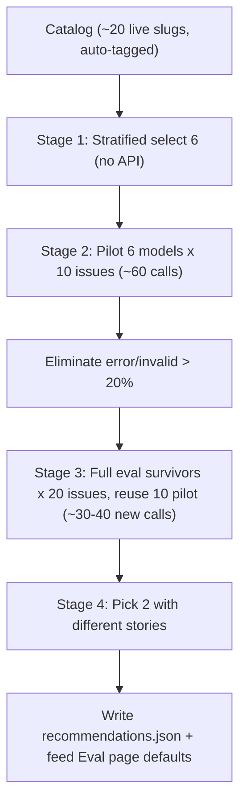

## Funnel flow

## Backend changes

### 1. Catalog tagging — `config/models_catalog.json` + `src/eval/model_catalog.py`
- Expand `models_catalog.json` candidates with fields: `family` (qwen/llama/deepseek/mistral/gemma/glm/gpt-oss/kimi), `parameter_b` (int), `size_class` (small/medium/large/very_large), `reasoning` (bool), `instruct` (bool).
- Add `tag_model(slug)` in `model_catalog.py` that parses a slug to infer family/size/reasoning when the slug is not in the static catalog (covers live-only slugs).
- Keep `_is_open_weight_chat` filter; the funnel only considers open-weight chat models.

### 2. Stratified selection (Stage 1) — `src/eval/model_catalog.py`
- Add `stratified_select(slugs: list[str], k: int = 6) -> list[dict]`.
- Group slugs by `(size_class, reasoning)`. Pick one representative per group (prefer instruct, then smallest within group for cost coverage). Cap at 6.
- Return list with `{slug, family, size_class, parameter_b, reasoning, role, selection_reason}`.
- Selection reason string: "Covers the small/fast tier" etc., derived from the group.

### 3. Single-model run primitive — `src/eval/orchestrator.py`
- Add `async def run_single(model, issues, *, run_id, corpus_version, use_mock, progress_callback, cancel_event) -> RunManifest` to `EvalOrchestrator`.
- Reuses `InferenceRunner` with one backend; writes `predictions.jsonl`; computes metrics for that one model via `compute_run_metrics` (pass `model_a=model, model_b=model` so the accumulator's pairwise step is a no-op).
- This is the building block for pilot and full eval. The existing `run_comparison` stays for the 2-model UI.

### 4. Funnel orchestrator — `src/eval/funnel.py` (NEW)
- `class FunnelOrchestrator` with `async def run_funnel(*, use_mock, cancel_event, progress_callback) -> FunnelResult`.
- Stage 1: call `stratified_select` on live slugs from `fetch_live_models()`.
- Stage 2 (pilot): run each of 6 models on 10 stratified scored issues (reuse `_prioritize_scored` + `[:10]`). Persist per-model predictions to `results/funnel/{funnel_id}/pilot/{slug}/predictions.jsonl` + `metrics.json`. Compute pilot summary: accuracy, cost_per_call, p95_latency, error_rate, invalid_rate. Eliminate if error_rate > 0.2 or invalid_rate > 0.2.
- Stage 3 (full): run survivors on a **stratified 20-issue** subset of the scored set. The 20 = the 10 pilot issues + 10 additional stratified scored issues. **Reuse the 10 pilot predictions** per survivor (copy from `pilot/{slug}/predictions.jsonl`), only run the 10 new issues live. So Stage 3 costs only `survivors × 10` new calls (~30-40). Persist combined 20-issue predictions to `results/funnel/{funnel_id}/full/{slug}/`. Compute: accuracy, macro_f1, per_class, confusion_matrix, cost_per_call, throughput, p95_latency.
- Stage 4 (recommendation): score survivors. `model_a` = best value (max `accuracy / cost_per_call`, tiebreak macro_f1). `model_b` = highest accuracy (max accuracy, tiebreak macro_f1). If same model wins both, `model_b` = second-highest accuracy. Reject if the two are within 2pp accuracy AND within 1.5x cost (nearly identical) — pick next distinct model.
- Write `config/recommendations.json` with computed `rationale` ("Evaluated N models across 4 stages. Finalist A: best value at X% accuracy / $Y per call. Finalist B: highest accuracy at Z%.") and `elimination_summary` with real per-stage rejections.
- `progress_callback` fires per stage with `{stage, model, completed, total}` so the UI can render incremental progress.

### 5. Persistence — `src/eval/persistence.py`
- Add `FunnelRun` pydantic model: `funnel_id, timestamp, status, stage_reached (1-4), pilot_model_slugs, full_model_slugs, recommended_a, recommended_b, rationale, elimination_summary, started_at, finished_at`.
- Add `funnel_runs` table to `RunStore._init_db` + `upsert_funnel`, `get_funnel`, `list_funnels` methods.

### 6. Run manager + API — `src/eval/run_manager.py` + `src/api/main.py`
- `RunManager`: add `self._funnel_task`, `self._funnel_progress`, `self._funnel_cancel_events`. Add `start_funnel(use_mock)`, `cancel_funnel(funnel_id)`, `get_funnel_progress(funnel_id)`.
- New endpoints in `main.py`:
  - `POST /api/funnel/start` (body: `{use_mock, confirm_spend}` — live requires confirm_spend)
  - `GET /api/funnel/{funnel_id}` (returns full funnel result with all stage data)
  - `GET /api/funnel/{funnel_id}/status` (returns current stage + per-model progress)
  - `POST /api/funnel/{funnel_id}/cancel`
  - `GET /api/funnel?limit=10` (list past funnels)

## Frontend changes

### 7. API client — `frontend/src/lib/api.ts`
- Add `FunnelStageResult`, `PilotModelResult`, `FullModelResult`, `FunnelResult`, `FunnelStatus` types.
- Add `api.startFunnel`, `api.funnel`, `api.funnelStatus`, `api.cancelFunnel`, `api.funnels`.

### 8. New Model Selection page — `frontend/src/pages/ModelSelectionPage.tsx` (NEW)
- Four stage cards in a vertical funnel layout.
- Top: "Run model-selection funnel" button (requires confirm_spend for live; mock toggle like Eval page). Shows total estimated cost (~90-100 calls).
- Stage 1 card: 6 candidates as chips with tags (size class, reasoning, family) + selection reason.
- Stage 2 card: 6 models in a table with pilot metrics (accuracy, cost/call, p95 latency, error rate, invalid rate) + pass/fail badge.
- Stage 3 card: 3-4 survivors with full metrics (accuracy, macro F1, cost/call, throughput, p95) + a mini confusion matrix per model.
- Stage 4 card: the final two with their production stories ("Best value" vs "Highest accuracy") + the computed rationale.
- CTA after completion: "Compare these two on the Eval page" button → navigates to `/?run=...` or pre-fills model_a/model_b.
- Progress polling every 2s while running; Cancel button.

### 9. Eval page defaults — `frontend/src/pages/EvalPage.tsx`
- On mount, fetch the latest successful funnel recommendation (`GET /api/funnel?limit=1`). If present and no `?run=` param, default `modelA`/`modelB` to `recommended_a`/`recommended_b`.
- Keep the manual dropdown override (user can still pick any two). Add a small "Recommended" badge next to the recommended two in the dropdown options.

### 10. Navigation — `frontend/src/components/Layout.tsx` + `frontend/src/App.tsx`
- Add nav link "Model Selection" to Layout.
- Add route `/selection` → `ModelSelectionPage` in App.

## Tests

### 11. `tests/test_stratified_selection.py`
- Verify grouping by (size_class, reasoning) and cap at 6.
- Verify one representative per group (prefer instruct, then smallest).
- Verify deterministic output for a fixed slug list.

### 12. `tests/test_funnel.py`
- Mock-based end-to-end: 6 mock models, 10 pilot issues, verify elimination of a model injected with >20% errors.
- Verify Stage 4 picks two distinct models (not the same model for both slots).
- Verify `recommendations.json` is written with computed rationale referencing real numbers.

### 13. `tests/test_run_single.py`
- Verify `run_single` produces a manifest with one model and metrics compute correctly.

## Trade-offs
- **Cost**: each live funnel is ~90-100 API calls (pilot 6×10=60, full survivors×10 new=~30-40, with 10 pilot predictions reused per survivor). The UI shows the estimate and requires confirm_spend. Mock mode is available for testing.
- **Statistical reliability**: Stage 3 uses 20 stratified issues, not 150. Accuracy/F1 are defensible for a model-selection decision (ranking models) but not for final production claims — the final 2-model comparison on the Eval page can still use the full 150-issue scored set for the definitive numbers.
- **Time**: pilot + full eval takes a few minutes (most of it is the 60 pilot calls). Background execution + progress polling + cancel are required (reuse the RunManager pattern).
- **Determinism**: Stage 1 stratified selection is deterministic given the live slug list. Stages 2-4 depend on live model behavior and may vary between runs; the recommendation is timestamped and stored so the UI shows the latest.
- **Pilot reuse**: the 10 pilot issues must be a subset of Stage 3's 20 issues so predictions can be reused. The funnel orchestrator constructs the 20-issue list as `pilot_10 + next_10_stratified` and copies pilot `predictions.jsonl` rows into the full-eval prediction files before running the 10 new issues.
- **Scope creep risk**: the funnel reuses the existing InferenceRunner and metrics accumulator, so no new inference/metrics code — only orchestration + persistence + UI.