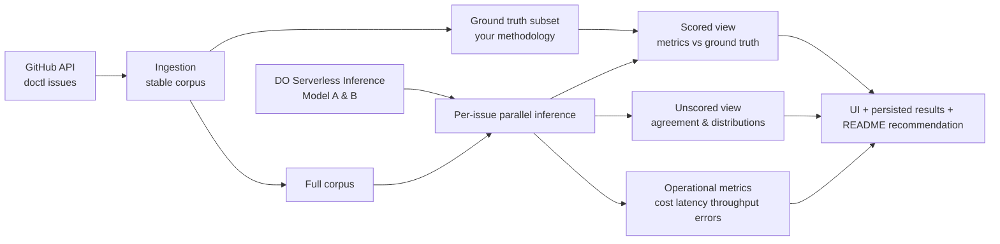

# Application Inputs and Outputs

## Application role

The application **is** the eval harness. It must both:

1. Run inference over the corpus
2. Present metrics and drill-downs in a UI

Reviewers will run the same code you used to produce your numbers.

---

## Inputs

### 1. Corpus data (GitHub issues from `digitalocean/doctl`)

| Input | Source | Notes |
|---|---|---|
| Issue records | GitHub public API | Open **and** closed issues |
| Typical fields used for classification | Title, body, and optionally labels/comments | PDF does not mandate which fields — your choice |
| Corpus stability | Must be identical across runs | Implement via snapshot/cache/versioned export |

**Ingestion constraint:** Keep ingestion thin (~few hundred lines max).

### 2. Ground-truth labels (evaluation subset)

| Input | Source | Notes |
|---|---|---|
| Labeled subset | **You construct this** | Not every issue needs a hand label |
| Ground-truth definition | **Your methodology** | Must be explainable in review |

The app classifies the **full corpus** but only the **labeled subset** gets scored metrics.

### 3. Model configuration (UI + runtime)

| Input | How provided | Notes |
|---|---|---|
| **Model A** | UI selector | From Serverless Inference available models |
| **Model B** | UI selector | Same |
| **Concurrency level** | Configurable **without container rebuild** | Env var, config file mount, or runtime flag — your choice |
| **Serverless Inference API key** | Environment variable (expected in README) | Required external service |

### 4. Inference call pattern (architectural input constraint)

| Rule | Detail |
|---|---|
| **One issue → one request** | No multi-issue batching in a single prompt |
| **Parallel execution** | Many concurrent single-issue requests allowed |
| **Retry granularity** | Per-issue failures must be individually retryable (implies per-issue request IDs / error tracking) |

---

## Outputs

### A. Classification results (all issues, both models)

For every issue in the full corpus, for each selected model:

- Predicted label (one of the six schema labels)
- Raw model output (required in unscored view)

### B. Scored view outputs (labeled subset only)

Against your ground-truth labels:

| Output | Required |
|---|---|
| Per-model **accuracy** | Yes |
| Per-class **precision, recall, F1** (or chosen equivalents) | Yes |
| **Confusion matrices** | Yes, side-by-side for Model A vs Model B |
| **Disagreement drill-down** | Issues where models disagree, with **ground-truth label visible** |

### C. Unscored view outputs (unlabeled subset)

No ground truth available:

| Output | Required |
|---|---|
| Each model's suggested label per issue | Yes |
| Raw model output per item | Yes |
| **Agreement rate** between Model A and Model B | Yes — headline number |
| **Per-class distribution** of suggestions per model | Yes |
| Filter/view for **model disagreement** cases | Yes |

### D. Operational metrics (per run, per model)

Reported for each evaluation run:

| Metric | Required detail |
|---|---|
| **Cost per call** | Yes |
| **Total cost** | Yes |
| **Cost calculation traceability** | Token counts × per-token rates visible in code |
| **p50 latency** (per request) | Yes |
| **p95 latency** (per request) | Yes |
| **Concurrency at measurement time** | Must be shown alongside latency |
| **Wall-clock time** (full run) | Yes |
| **Sustained throughput** | Requests per second |
| **Error rate** | Broken down: rate limit, timeout, other |

### E. Analytical / recommendation outputs (exercise-level, primarily README + review)

Not necessarily separate UI screens, but must be producible from your work:

| Output | Where |
|---|---|
| List of all models evaluated | README + review discussion |
| **Two recommended production models** | README + pre-select or highlight in UI |
| Tradeoff narrative (capability vs cost vs latency vs parameter count) | README + review |
| Failure mode analysis per model | README / UI drill-downs |
| Production rollout plan (multi-repo) | README + review — **discussion only** |

### F. Persisted artifacts (zip deliverable)

| Artifact | Purpose |
|---|---|
| Labeled dataset file(s) | Reproducibility + reviewer inspection |
| Persisted eval results | Raw predictions, metrics snapshots, run logs |

Format not specified in PDF (JSON, CSV, SQLite, etc. — your choice).

**Implemented layout** (see [metrics-and-persistence.md](./metrics-and-persistence.md)):

```
data/
  corpus/doctl/v1/issues.jsonl       # Versioned corpus snapshot
  ground_truth/labels.json           # Reference labels + scored set flags

results/
  eval.db                            # Run registry (SQLite)
  runs/<run_id>/
    manifest.json
    checkpoint.json
    predictions.jsonl
    metrics.json
    errors.jsonl
```

---

## Runtime configuration (environment variables)

| Variable | Default | Purpose |
|---|---|---|
| `DO_API` | — | Serverless Inference API key |
| `GITHUB_TOKEN` | — | Optional; higher GitHub rate limits for corpus fetch |
| `CONCURRENCY` | `8` | Parallel inference workers |
| `MAX_RETRIES` | `3` | Per-issue retry limit |
| `BODY_TRUNCATE_CHARS` | `8000` | Max issue body characters |
| `MODEL_CONTEXT_TOKENS` | `32768` | Context window budget |
| `COMPLETION_BUDGET` | `256` | Reserved completion tokens |
| `CHECKPOINT_EVERY_N` | `50` | Checkpoint flush interval |
| `ADJUDICATOR_MODEL` | `alibaba-qwen3-32b` | Ground truth LLM (≠ eval models) |

Full list: [inference-engine.md](./inference-engine.md).

---

## Ground truth inputs (implemented)

See [ground-truth-methodology.md](./ground-truth-methodology.md).

| Input | Location |
|---|---|
| Hybrid labels (rules + selective LLM) | `data/ground_truth/labels.json` |
| Scored subset flag | `in_scored_set: true` on 80–150 issues |
| Adjudicator model recorded | `adjudicator_model` field on LLM-labeled rows |

The app classifies the **full corpus** but only the **scored subset** drives accuracy / F1 / confusion matrices.

## End-to-end flow (summary)



---

## UI minimum surface (from PDF)

| UI element | Purpose |
|---|---|
| Model A selector | Pick first comparison model |
| Model B selector | Pick second comparison model |
| Run comparison action | Execute eval on same corpus |
| Scored results panel | Accuracy, per-class metrics, confusion matrices, disagreement drill-down |
| Unscored results panel | Labels, raw outputs, agreement rate, distributions, disagreement filter |
| Operational metrics panel | Cost, latency percentiles, wall-clock, throughput, errors (+ concurrency context) |

Exact layout, framework, and styling are **not specified**.
