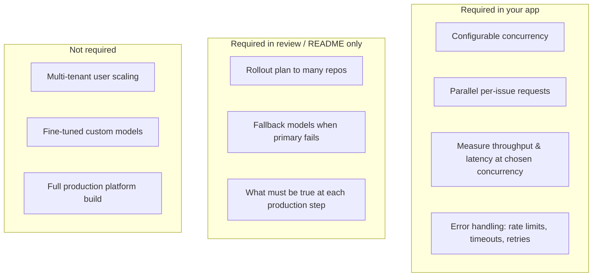

# Fine-Tuning and Scale — Direct Answers

## Is there a need to fine-tune any LLM for performance optimization?

### Answer: **No — not for this exercise.**

The PDF **never mentions fine-tuning**, custom training, RLHF, or adapter/LoRA workflows. The entire exercise is framed around **selecting among existing Serverless Inference models** and recommending which to run in production based on **evaluation metrics, cost, latency, and throughput**.

### What the exercise actually optimizes

| Optimization lever | In scope? | Evidence from PDF |
|---|---|---|
| **Model selection** (pick best off-the-shelf model) | ✅ Yes | "Evaluate a range of models and recommend two for production" |
| **Prompt / classification harness design** | ✅ Yes (implicit) | Per-issue inference, eval methodology |
| **Concurrency tuning** | ✅ Yes | Configurable parallelism; discuss tradeoffs |
| **Production routing / fallbacks** | ✅ Discussion only | "Handle cases where your chosen models fall short" — conceptual |
| **Fine-tuning / custom models** | ❌ Not required | Not mentioned anywhere |

### When fine-tuning might come up (optional talking point)

In the **production handling** discussion (scope item 5), you *could* mention fine-tuning as a **future lever** if off-the-shelf models fail on customer-specific taxonomy — but that is **your extrapolation**, not a PDF requirement.

**Recommended stance for review:**

> "We optimized by choosing the right base model and inference configuration, not by fine-tuning. Fine-tuning could be a phase-2 option if domain-specific labels diverge heavily from general model behavior, but it was out of scope for this eval harness."

### Reasons

1. Exercise compares **open-weight models on Serverless Inference** — a hosted inference API, not a training pipeline.
2. Required external service is **generation only** via SI API.
3. Evaluation focus is **accuracy vs cost vs latency tradeoffs between existing models**.
4. Credits are for **inference**, not training compute.
5. "We are not asking you to build that system" applies to production rollout — fine-tuning infrastructure would be even further out of scope.

---

## T0 vs T1 scale philosophy

The phased plan distinguishes what we **build now** from what we **architect for**:

| | **T0 — Build & demo** | **T1 — Architect for** | **Out of scope** |
|---|---|---|---|
| Scale | ~534 issues, 1 repo (doctl) | 10–100× (~5k–50k issues, many repos) | 1000× load tests, worker fleets |
| Ship | Full working eval on doctl | Hooks + README narrative | Production multi-tenant platform |

**T0 hooks already implemented:** versioned corpus partitions, checkpoint/resume, streaming metrics accumulator, JSONL append-only predictions, SQLite run registry, shared context truncator.

**T1 extrapolation (README, not load-tested):** prefix caching as primary cost lever; adaptive concurrency; paginated UI disagreement lists.

See [inference-engine.md](./inference-engine.md) and [metrics-and-persistence.md](./metrics-and-persistence.md).

---

## Does it need to handle users at scale?

### Answer: **Not multi-tenant production scale — but yes to inference throughput measurement.**

The distinction matters:

| Scale dimension | Required? | Detail |
|---|---|---|
| **Many concurrent inference requests** (processing ~500 issues in parallel) | ✅ Yes | "Processes the corpus with parallel inference requests"; concurrency configurable |
| **Throughput / latency metrics at that concurrency** | ✅ Yes | p50, p95, RPS, wall-clock, error rates |
| **High-volume customer scenario as narrative** | ✅ Yes | Customer runs classification "at high volume across many repositories" |
| **Multi-user SaaS / auth / horizontal app scaling** | ❌ Not required | PDF does not mention users, tenants, or load balancers for the UI |
| **Full production system across many repos** | ❌ Not required | "We are not asking you to build that system" |
| **Handling frontier-model-scale traffic in the deployed app** | ❌ Not required | Single-repo eval on ~500 issues |

### What "scale" means in this exercise

### Practical implementation bar

| Concern | Minimum acceptable | Nice to have (not required) |
|---|---|---|
| Process 534 issues with parallel calls | ✅ Required | — |
| Configurable `CONCURRENCY` env var | ✅ Required | Dynamic UI slider |
| Report RPS at stated concurrency | ✅ Required | Autoscaling charts |
| Survive SI rate limits gracefully | ✅ Required | Adaptive concurrency decay (planned) |
| Checkpoint/resume long runs | ✅ Implemented | Prevents credit loss on crash |
| Prefix cache cost tracking | ✅ Implemented | `cache_hit_rate`, `cache_savings_usd` per model |
| Support 100 concurrent human users on UI | ❌ Not specified | — |
| Shard across multiple repos live | ❌ Not specified | — |

### How to talk about scale in the review

Frame two layers:

1. **Eval harness scale (built):** "We measured that at concurrency=N, model X achieves Y req/s at p95=Z ms and $W per call — sufficient evidence for a production recommendation on similar issue volume."

2. **Customer production scale (discussed):** "To roll out across 50 repos, I'd snapshot each repo's issues, run the same harness, aggregate metrics, start with the cheaper model and route low-confidence cases to the larger model — without building that router in this exercise."

### Reasons

1. PDF asks for **operational metrics** (throughput, latency percentiles, wall-clock) — implies load-style measurement, not idle single-threaded runs.
2. PDF asks for **concurrency tradeoff discussion** — meaningless without parallel execution.
3. PDF explicitly **does not** ask you to build the multi-repo production system.
4. No mention of user authentication, session management, or horizontal scaling of the web app.
5. Customer "high volume" is the **business scenario** motivating model cost optimization, not a spec for your demo app's QPS.

---

## Summary table

| Question | Answer |
|---|---|
| Must we fine-tune an LLM? | **No** |
| Should we compare pre-trained SI models? | **Yes** |
| Must the app run parallel inference with configurable concurrency? | **Yes** |
| Must we report throughput/latency/cost at that concurrency? | **Yes** |
| Must we build a multi-user production platform? | **No** |
| Must we explain scaling to many repos in README/review? | **Yes (discussion)** |
