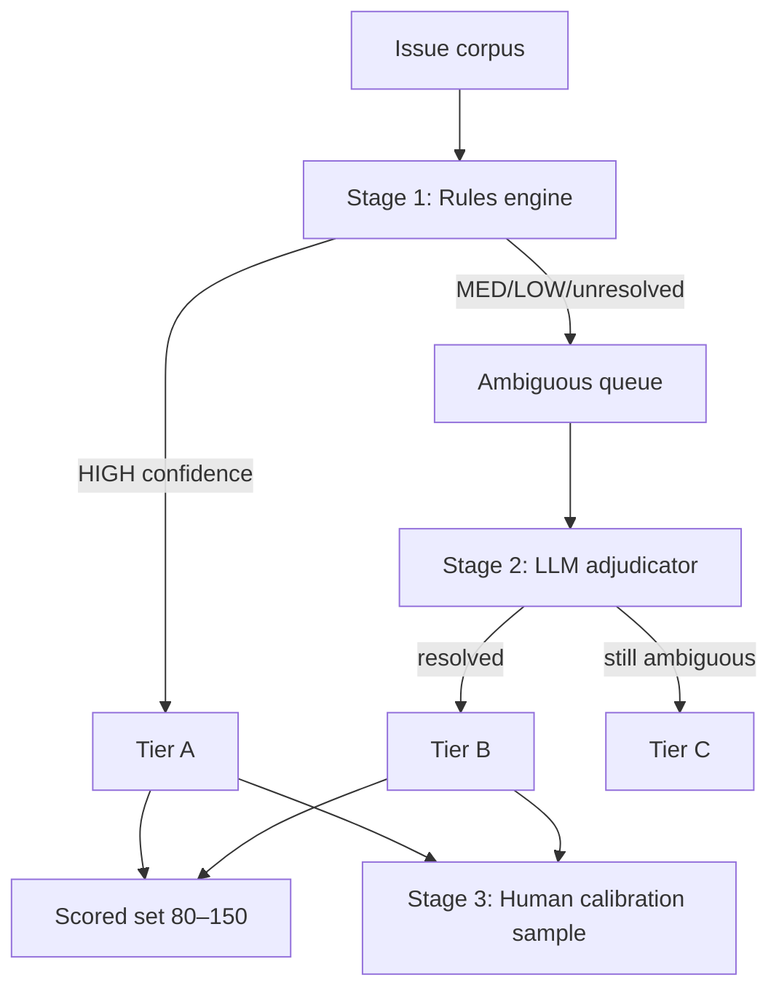

# Ground Truth Methodology

This document describes how reference labels are built for the scored eval subset. It reflects the **implemented Phase 2 pipeline** (`src/ground_truth/`) and the scale path documented in the phased plan.

---

## Why hybrid labeling?

The PDF requires a ground-truth subset but does **not** require hand-labeling every issue. Maintainer labels on `digitalocean/doctl` are inconsistent (~316 issues lack a clean single native category label).

| Approach | Problem at ~534 issues | Problem at 10–100× |
|---|---|---|
| Rules only | Misses ambiguous cases; mislabels conflicts | Cheap but inaccurate on edge cases |
| LLM on everything | Cost, latency, non-determinism; circular-trust risk | Prohibitively expensive at 50k issues |
| **Hybrid (chosen)** | Rules for ~60–70%; LLM on ambiguous queue only | Same funnel; rules mature over time |

---

## Three-stage pipeline



### Stage 1 — Rules engine

**Module:** `src/ground_truth/rules_engine.py`

- Map native GitHub labels via `NATIVE_TO_CUSTOMER` (see [labels-analysis.md](./labels-analysis.md))
- Apply title/body heuristics (CVE patterns → `security`, question patterns → `question`, etc.)
- **Score-based Density Resolution:** If multiple conflicting text heuristics match (e.g. contains both documentation typos and crash keywords), calculate a match score for each category (count of matching patterns). If the top category's score dominates the runner-up's score by a difference of 2 or more, resolve the tie deterministically (assigning `confidence = "MED"` and `proposed_label = top_category`), bypassing LLM routing.
- **Native-Heuristic Cross-Validation:** Compare the mapped native label to the resolved text heuristic. If they **conflict** (e.g. native label says `bug` but text heuristics indicate `question`), demote the confidence to `"LOW"` and set `proposed_label = None`. This routes the conflict to the LLM adjudicator for validation, preventing silent maintainer mislabeling.
- **Security Override:** If `"security"` matches via a high-value pattern (like `CVE-` or `GHSA-`), automatically select `"security"` and override other matches.
- Ignore workflow-only labels (`blocked`, `wontfix`, `help wanted`, …) for category assignment
- Output: `proposed_label`, `confidence` (`HIGH` / `MED` / `LOW`), `mapping_reason`

**HIGH → Tier A** (eligible for scored set). **MED / LOW / unresolved → ambiguous queue.**

### Stage 2 — LLM adjudicator (selective)

**Module:** `src/ground_truth/adjudicator.py`

- Runs **only** on the ambiguous queue, not the full corpus.
- Uses a **fixed adjudicator model** (`ADJUDICATOR_MODEL`, default **`deepseek-v4-pro`**) that must **not** be one of the Model A / Model B comparison candidates.
- Prompt: `config/ground_truth_adjudication_v1.txt` — enriched with formal category definitions, edge-case rules, and few-shot examples.
- **Comment-Aware Ingestion:** Dynamically fetches comments from the GitHub API using `GITHUB_TOKEN`. Formats and appends the last 3 comments from the author or maintainers/collaborators (excluding system/bot comments) to the LLM context, ensuring the LLM is aware of final issue resolutions (e.g. closures due to user configuration errors).
- **Adjudication caching:** To guarantee 100% reproducibility and minimize API token costs, the pipeline hashes the issue context (title + body + comments + prompt). If a hash matches a cached result in `data/ground_truth/adjudication_cache.json`, it is reused directly, bypassing the live API.
- Output JSON: `{ "label", "confidence", "rationale" }`
- **Tier B** if label valid and confidence high/medium; else **Tier C**

**Context overflow:** The adjudicator uses the same shared truncator as inference (`src/inference/context.py`). The truncator performs **Smart Middle Truncation**, extracting the first $50\%$ and last $50\%$ (offset by a truncation placeholder) to preserve user descriptions at the top and stack trace/log endings at the bottom.

**Circular evaluation guardrail:** Never score a model against labels produced by that same model. Record `adjudicator_model` on every LLM-labeled row.

### Stage 3 — Human calibration

**Module:** `src/ground_truth/calibration.py`

- Stratified sample (~30–50 issues) across classes and tiers
- Template in `data/ground_truth/human_calibration.json` for spot-checks
- Used to validate rules/LLM quality in review — not a full relabeling pass

---

## Scored eval subset

**Target:** 80–150 issues, stratified across the six customer labels where possible.

| Source | Typical share | Trust |
|---|---|---|
| Tier A (rules, HIGH) | ~50–70% of scored set | Silver — auditable |
| Tier B (LLM adjudicated) | ~30–50% of scored set | Medium — model-assisted |
| Tier C | **Excluded** from scoring | Unresolved / low confidence |

Selection logic: `select_scored_set()` in `src/ground_truth/pipeline.py`.

---

## Output artifacts

| File | Contents |
|---|---|
| `data/ground_truth/labels.json` | Per issue: `label`, `tier`, `source`, `confidence`, `mapping_reason`, `in_scored_set`, `adjudicator_model` |
| `data/ground_truth/comments_cache.json` | Local cached comment threads fetched from GitHub |
| `data/ground_truth/adjudication_cache.json` | Deterministic cache of LLM completions indexed by context hashes |
| `data/ground_truth/ambiguous_queue.json` | Issues routed to LLM adjudicator |
| `data/ground_truth/human_calibration.json` | Stratified review template |
| `data/ground_truth/pipeline_metrics.json` | Counts: rules HIGH/MED/LOW, LLM queue size, scored set size |
| `data/ground_truth/methodology.md` | Auto-generated pipeline summary |

---

## Commands

```bash
# Development / CI (no API calls)
python -m ground_truth.pipeline --mock-llm
# or: make build-ground-truth

# Production-quality labels (fetches comments & uses adjudication cache)
python -m ground_truth.pipeline
```

Requires `DO_API` for live adjudication, and `GITHUB_TOKEN` for dynamic comment fetching.

---

## Current corpus stats

From the latest live `deepseek-v4-pro` adjudication pipeline run on 534 doctl issues:

- Rules: HIGH = 267, MED = 95, LOW = 172
- LLM Queue Size: 267
- LLM Resolved (Tier B): 267
- Scored set: 125 issues (57 Tier A + 68 Tier B)
- Balanced distribution: 25 bugs, 25 enhancements, 25 questions, 25 security, 12 documentation, 13 other.

---

## Scale path (T1 — architectural)

At 10–100× issue volume, the same funnel applies with shifting ratios:

| Stage | T0 (~534) | T1 (~5k–50k) |
|---|---|---|
| Rules coverage | ~68% | ~75–80% (rules improve) |
| LLM adjudicator | ~32% of corpus | ~10–15% uncertain queue |
| Human calibration | 30–50 spot checks | ~0.5–1% review queue |

Do **not** run LLM adjudication on every issue at scale — rules are the backbone; LLM is the accuracy layer for hard cases only. Caching guarantees sub-linear token costs as issues are updated.
